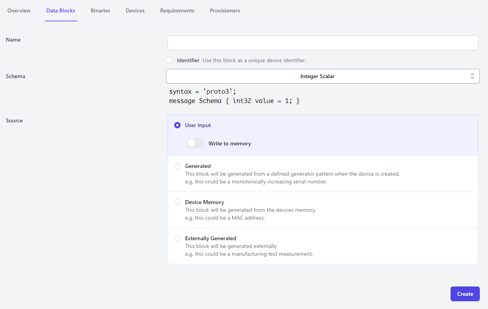

# Data Blocks

Data blocks describe what data is associated with your device. This encompasses input parameters,
test measurements, configuration parameters, and automatically derived values.

Data can only be associated with a device once a block has been created that describes the data.

## Creating Data Blocks

When you create a new data block, you will be prompted for four pieces of information, outlined
below:
1. What is the name of the data block being created
2. Is the block a representation of the unique device identifier
3. What is the schema of the data represented?
4. What is the source of the data?

### Identifier Blocks
One data block may be marked as the "Identifier". In this case, the value associated with the block
will be used for display purposes in the "Devices" pane. Often, the "Identifier" should be the
device serial number or other unique value to differentiate between devices.

The identifier can be selected for any data block, but only one data block may be marked as the
identifier. If a new block is selected as the identifier, any previous identifier selection will be
erased.

### Block Schemas

The "Schema" associated with the block outlines the specific format of data within the block. The
"Schema" is used for serialization and deserialization of the data contained within the block.

The following schemas are available:

| Name | Description | Example |
| :---: | :--------- | :------ |
| Integer Scalar | A single integer value. | For example, this could be the number of outputs installed on a unit.
| Float Scalar | A single real number. | For example, this could represent the measured device supply voltage during testing.
| String Scalar | A single string. | This could be the human-readable serial number of the device. |
| Float Array | A sequence of real numbers. | This could be a series of voltage measurements taken on an output waveform from the device during testing.
| Integer Array | A sequence of integer values. | This could be a configuration parameter for all of the output channels of a device. |

#### Block (De)Serialization

Serialization and deserialization are transformations on the data block to convert it between
human-readable and binary representations. The serialization and deserialization process utilizes
protobuf3 specifications.

When the block is written to device memory, the data block must be serialized. This process occurs
immediately when the data block is uploaded to forged.dev.

Deserialization is completed when displaying data blocks on the "Devices" pane in the forged.dev UI.

### Block Sources

Blocks may have a number of sources, which means where the data comes from.

The following sources are supported.

| Source | Description |
| :----: | :---------- |
| User Input | The data is supplied by the operator at the start of the provisioning process. |
| Generated | The data is automatically generated when the provisioning process is started. |
| Device Memory | The data is collected by reading non-volatile memory from the device during the provisioning process. |
| Externally Generated | The data is provided by an external, automated source (such as a manufacturing test) at any point during the provisioning process. |

The `source` specification impacts how the forged.dev provisioning UI interacts with your project.
Specifically:
* `User Input` blocks will be requested from the operator at the very start of the provisioning
process.
* `Device Memory` blocks will be read from the device towards the start of the provisioning process
and automatically uploaded to forged.dev
* `Generated` blocks will be automatically generated for the product and will be accessible to
future steps of the provisioning process (i.e. manufacturing test scripts, provisioning scripts)
* `Externally Generated` blocks are assumed to be provided by an external test script

#### Persisting Data to the Device
Data blocks can optionally be written into device flash as part of the programming procedure. This
enables powerful functionality, such as the ability to automate device-specific calibration
parameters to achieve necessary accuracy and tolerance parameters for your product.
