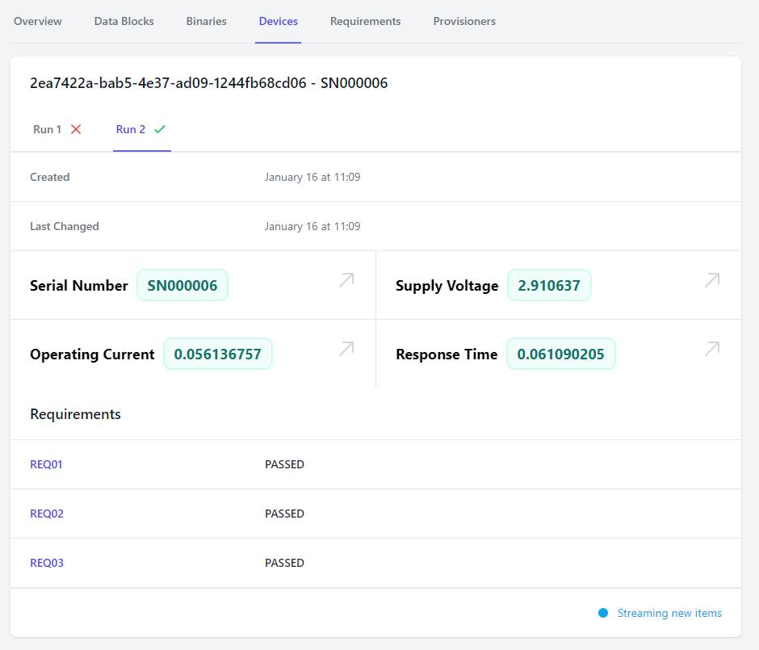

# Devices

A "Device" in forged.dev refers to a real, physical piece of hardware that has been built as part of
your project.

A device has characteristics (such as supply voltages, current requirements, operating
characteristics) that are associated with it, and these characteristics do not change without
physical modification of the hardware or firmware.

## Background

When a device is run through the provisioning process, generally, the following occurs:
1. Data about the identity of the device is collected (such as the serial number)
2. The device is programmed with the latest firmware
3. The device identifiers are programmed into the device so that it knows its own identity
4. The device electrical characteristics are tested against requirements
5. The device is marked as passing or failing based on the results of the previous steps

## Device Runs

Often times, a defect may be found in a device (or the test system) that is then corrected. The
device is then run through the provisioning process a second time to see if the issue has resolved.
Each execution of the provisioning process is called a "Run".

## Device Views

When a device is run through the provisioning process, all of the data associated with it is
collected and stored for presentation in the user interface.

As you can see, each of the `Data Block`s captured in the run are displayed in the user interface.
Additionally, all of the tested requirements are displayed. This information offers a comprehensive
report of the provisioning process for the device to give you confidence that your devices are
operating to specification.

### Logs

Devices support displaying logs as part of the overview. Logs are generated by the provisioner
during the provisioning process.

## Attachments

Similar to logs, devices may have attached data files, such as images or test data. These
attachments are associated with a run and can be viewed and downloaded directly from the forged.dev
user interface.
