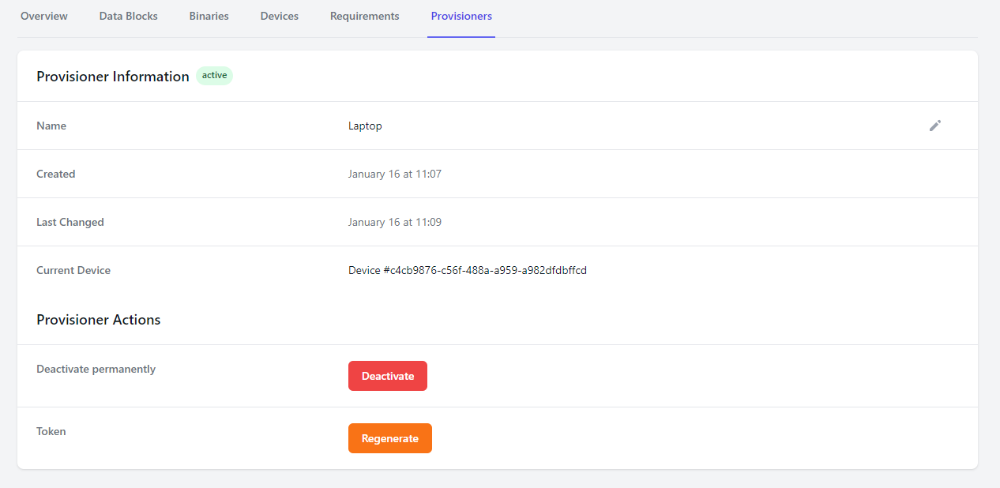

# Provisioners

Provisioners enable a method for your test and provisioning system to communicate with forged.dev.

A provisioner is a computer that completes some physical operation, such as provisioning and testing
a new device.

forged.dev supports any number of provisioners creating and processing many devices simultaneously.

## Provisioner Overview

The provisioner is responsible for driving the provisioning process of a specific device.
Provisioners communicate with the forged.dev servers throughout the provisioning process to record
device-specific information, download firmware binaries, and record results and logs.

There are two primary options for controlling the provisioner:
1. Utilize one of the released forged.dev API clients to customize the provisioning process
2. Utilize the Provisioner UI to automate the provisioning process

### Provisioner UI

The provisioner UI is downloadable via the `Releases` tab on the left of the forged.dev UI after you
log in. It will guide you through the installation and setup process.

The provisioner UI is a tool released by forged.dev to provide a user-friendly, automated interface
with forged.dev. The UI:
1. Automatically adapts to your project's data
1. Automatically requests user input data at the start of the provisioning process
1. Flashes firmware onto your device if there is a binary specified
1. Performs a custom-specified test script after programming
1. Indicates the final result of the provisioning process

The UI is intended to operate as a non-technical interface with forged.dev tooling.

The UI also allows an operator to re-run the provisioning process on a device to attempt to remedy
an issue with the provisioning process. The results from all runs will be recorded separately.

### API Clients

Forged publishes clients for interfacing with the forged.dev website that can be incorporated
directly into your existing provisioning processes. The client allows you to:
* Download the latest firmware image
* Upload and download device data blocks
* Upload device logs
* Upload attachments associated with a device

Please reference the associated API client for further documentation on capabilities.

## Regenerating Tokens

The provisioner communicates with the forged.dev service using a secret authentication token.

If a provisioner token is lost or compromised, it should be regenerated. This can be accomplished on
the provisioner data screen, where the "Regenerate" button will regenerate a new token.

## Deactivating Provisioners
When a provisioner is no longer needed, it can be deactivated. Deactivating a provisioner disables
the token associated with the provisioner

There is no method to delete a provisioner. This is intentional to ensure that there is traceability
from a device to the provisioner that originally created it.
