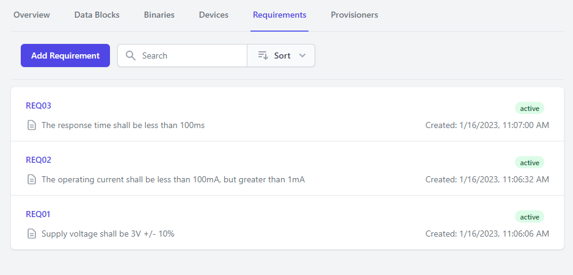
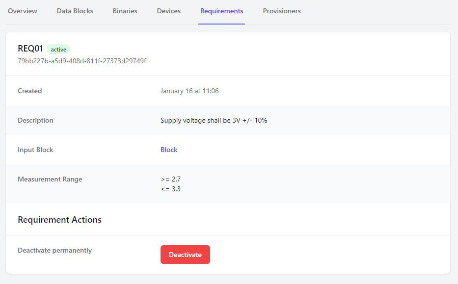

# Requirements

Requirements outline specific checks that are completed against collected data blocks.

Requirements are used to determine if a device "passes" or "fails" the provisioning process.

When a device finishes the provisioning process, all of the currently active requirements are tested
against the data collected for the device. A device will only "pass" at this stage if:
1. All of the data blocks needed for requirement checks exist
2. All the data block measurements conform with the required limits.

## Limitations
Requirements are only supported for simple numerical data blocks (i.e. single numbers).

Currently, requirements only support number ranges, with optional upper and lower bounds. Bounds may
be inclusive or exclusive.

If you have more complex use cases, please get in touch with the forged.dev team.

## Creating Requirements
In order to create a new requirement, you must first specify the data block that the requirement is
tested against.

Data blocks that can be used for requirements must use either the "Integer scalar" or "Float scalar"
schema.

The "name" field should be a unique requirement specifier for the project.
The "Description" field is used for informational display about the requirement.

## Deactivating Requirements
When a requirement is no longer required for your design, it can be deactivated. Deactivation can
only happen once, and requirements cannot be reactivated.

Deactivating requirements does not delete the requirement. This is intentional, as it ensures
traceability for devices that may have used the now-deactivated requirement in the past, and it
shows what those devices were tested against.
